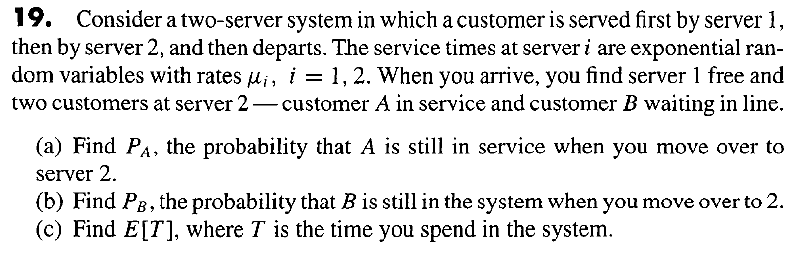

# Punto 5

## Enunciado

Resolver (a) Analíticamente y (b) Mediante experimentos de simulación, el ejercicio #19 de la página 57 del PDF del libro Probability Models for Computer Science de Sheldon M. Ross. Los entregables del literal (a) deben seguir los lineamientos de una tarea manuscrita mientras que los del literal (b) los de una tarea automatizada. El lenguaje de programación y las demás herramientas informáticas que requieran las podrán seleccionar libremente.